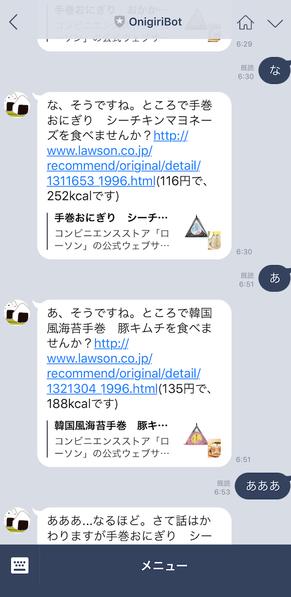

# Onigiri Bot

This repository contains my personal training assets for LINE chat-bot development.

## Demo

version 0.1 2018/3/30

Screen shot

QR code to make friends with onigiribot 

## how to run

### local-dev

use nglok

https://ngrok.com

### deployment

use now

https://zeit.co

plesse specify your DEVELOPER CHANNEL's key and token with "now secrets" command.

``
$ now secrets add my-secret-key xxxxxxxx
$ now secrets add my-access-token xxxxxxxx
``

